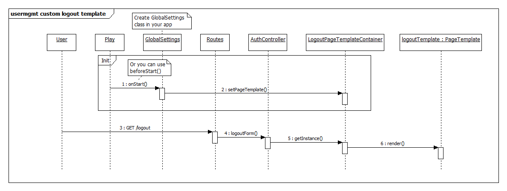

# Xi User Management Module

## How to use the module

* After clone project run locally (with activator) ```publish-local```

* Add module dependency to ```build.sbt```:

```"co.wds" %% "usermgmt" % "1.0-SNAPSHOT"```

* Add repository for deadbolt plugin to ```build.sbt``` in main application:
```resolvers += Resolver.url("Objectify Play Repository", url("http://deadbolt.ws/releases/"))(Resolver.ivyStylePatterns)```

* For downloading modules routes add to routes file the following line:

```->     /        usermgmt.Routes```

* Make sure you have a database named ```usermgmt```

* In main application add empty file ```1.sql``` in evolution.usermgmt

* Use ```@Dynamic``` annotation. 
Note: add ```import static ximodels.usermgmt.Role.Names.*;``` to get Roles constants.
If your method has annotated like  ```@Dynamic(LOGGED_IN)```, then to method have access all logined users. Use annotation ```@Dynamic(ADMIN)``` for allow access only admins.

## How to login at first time

* To login use next credentials:
```
login: admin
password: password
```

* Change the password at ```/administration``` page

## How to create custom login (or logout) page

* Create your own scala template with ```defaultContent: Html``` parameter and inject base template throw ```@defaultContent``` expression

* Implement controllers.usermgmt.PageTemplate java interface for login (or logout) page like:
```
	private static PageTemplate createCustomTemplate(){
		return new PageTemplate() {
				@Override
				public Html render(Html defaultContent) {
					return myCustomTemplate.render(defaultContent);
			}
		};
	}
```
where ```defaultContent``` injects into your own scala template

* Create (if necessary) Global class at default package and set your custom templates on app start:
```
import controllers.usermgmt.AuthTemplates;
import controllers.usermgmt.PageTemplate;
...

public class Global extends GlobalSettings {

	@Override
    public void onStart(Application app) {
    	PageTemplate customLoginTemplate = ...
    	PageTemplate customLogoutTemplate = ...
    	
		AuthTemplates.setLoginTemplate(customLoginTemplate);
		AuthTemplates.setLogoutTemplate(customLogoutTemplate);
	}

}
```

UML Sequence diagrams:

